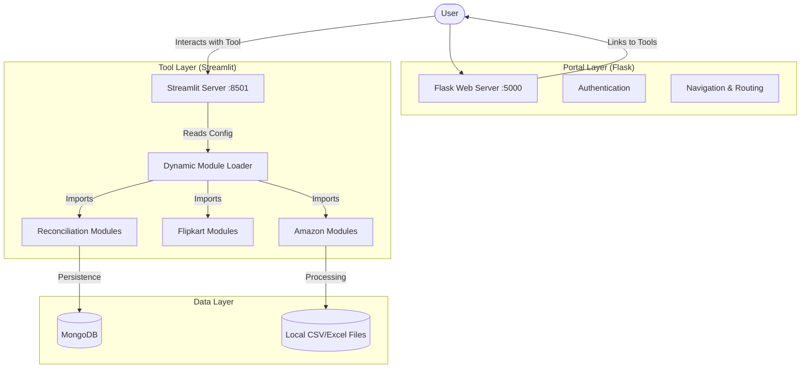

# Snaphire Detailed README

Welcome to the SnapHire application documentation. This document provides a high-level overview of the application's architecture, setup instructions, and deployment details.

## 🏛️ Architecture Overview

SnapHire is designed as an "Operations Super App" that combines the flexibility of Streamlit for data handling and the robustness of Flask for application management.

### System Diagram



## 🚀 Getting Started

### Prerequisites
- Python 3.10+
- MongoDB instance (Local or Atlas)
- Node.js (Optional, for any frontend extensions)

### Installation

1. **Clone the repository:**
   ```bash
   git clone <repository-url>
   cd Flask_Code_App
   ```

2. **Set up virtual environment:**
   ```bash
   python -m venv .venv
   source .venv/bin/activate  # On Windows: .venv\Scripts\activate
   ```

3. **Install dependencies:**
   ```bash
   pip install -r requirements.txt
   ```

4. **Environment Configuration:**
   Copy `.env.example` to `.env` and fill in your credentials.
   ```bash
   cp .env.example .env
   ```

### Running the Application

To start both the Flask portal and the Streamlit tools server simultaneously, use the launcher:

```bash
python run.py
```

- **Portal Access:** `http://localhost:5000`
- **Streamlit Port:** `http://localhost:8501`

## 🛠️ Key Components

- **`run.py`**: The multi-process launcher that orchestrates both servers.
- **`flask_app/routes.py`**: Manages user authentication and the iframe-based navigation to tools.
- **`streamlit_app.py`**: A generic Streamlit host that dynamically imports logic from the `modules/` directory based on URL parameters.
- **`modules/`**: The heart of the application where all business logic for data processing is stored.

## 🚢 Deployment

The application is configured for deployment on platforms like Vercel or Railway.

- **Vercel**: Uses `vercel.json` and `index.py` for serverless deployment.
- **Docker**: A `Dockerfile` is provided for containerized environments.
- **Procfile**: For Heroku/Render-style deployments.
